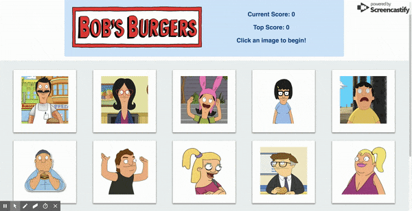

# Bob's Burgers Memory Game

## What this does:
This is a game that tests your memory - see if you can hit all 12 images without clicking on the same one!

## How the code works:
The app uses React and Bootstrap. Within React, the app is set up to use components, props and state changes.

## How to run the app/deployed version:
https://bobs-burgers-game.herokuapp.com/

